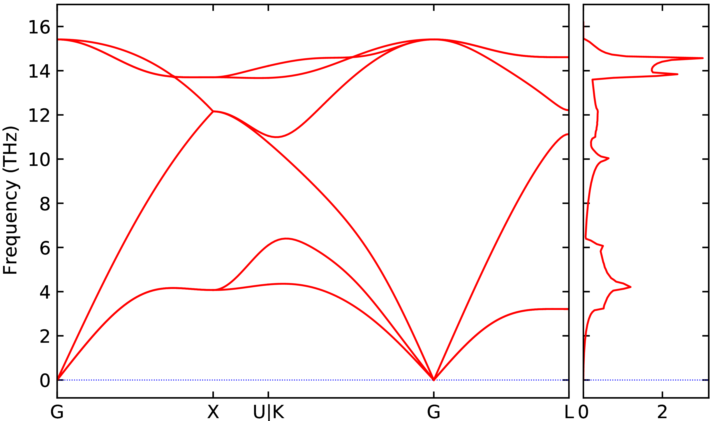

<a name="Running Multiple Phonopy Calculations"></a>

??? info "Prerequisite"
    Please complete the [high-throughput phonon tutorial](1_phonopy.md) before completing this one

## Summary
In this section we will learn how to set up and run multiple multi-step workflows using FHI-vibes and FireWorks.

FK: technically we optimize the k-point density of the Monkhorst-Pack grid in FHI-aims (which is normally defined by setting k_grid) ->
We will start by learning how to converge the `k_grid` parameter for FHI-aims and optimize the structure of Si before performing phonopy calculations.

FK: why do we do both? ->
Once this is done we then use the converged harmonic model to set up Monte Carlo and Molecular Dynamics based sampling and quantify a material's anharmonicity.

## Optimizing the k-point Density and Geometry

Now that basic phonopy calculations have been explained, let's make the workflows more useful by adding two preprocessing tasks to the workflow before the phonopy calculations: k-grid convergence and geometry optimization.

### k-grid Optimization
```
[optimize_kgrid]
dfunc_min:                     1e-3

[optimize_kgrid.qadapter]
nodes:                         1
walltime:                      01:00:00
```
Because a single k-point density may not give converged yet efficient  results for every material in a test set, we provide the option to converge the k-point density with respect to the total energy for all materials.
This task will increase the k-point density defined in `calculator.kpoints.density` by 1.0 until successive increases of the density results in a change of energy less than `optimize_kgrid.dfunc_min` eV.
It will then use that k-point density for all future calculations in the workflow.

In this example the convergence criteria is set to 1 meV to decrease computational time, but this can be changed to any desired level of accuracy.
The default value is 0.001 meV.

### Relaxation

```
[relaxation.1]
basis:                         light
driver:                        BFGS
fmax:                          0.001
unit_cell:                     True
decimals:                      12
maxstep:                       0.2
fix_symmetry:                  True

[relaxation.1.qadapter]
nodes:                         1
walltime:                      00:15:00
```
Optimizing the geometries for high-throughput calculations are largely similar to the command line interface, but with numerically numbered sections.
Instead of using `[relaxation]` and `[relaxation.kwargs]` as done in the command line interface both of these sections are combined into `[relaxation.1]`, `[relaxation.2]`, ..., `[relaxation.n]` sections.
This is done to allow for a multi-stage relaxation, where the basis set or unit cell restrictions can be changed to improve the performance of the algorithms.
To accommodate the potential change in basis each relaxation step can have its own basis set that is different from the main calculation, set by the `relaxation.n.basis` keyword.
Each of these relaxation steps will also have their own `qadapter` as they all may have different costs associated with them.

### The Full Workflow
Below is the complete workflow file for the calculations, we removed the phonon convergence and only studying Si to save time.

??? info "`workflow.in`"
    ```
    [files]
    geometry:                      Si/geometry.in

    [fireworks]
    name:                          example_multistep_calculations
    
    [fireworks.workdir]
    local:                         analysis/
    remote:                        run/
    
    [calculator]
    name:                          aims
    
    [calculator.parameters]
    xc:                            pw-lda
    
    [calculator.kpoints]
    density:                       1
    
    [calculator.basissets]
    default:                       light
    
    FK: move to [calculator] as socketio: True + check above ->
    [calculator.socketio]
    port:                          12345
    
    [phonopy]
    supercell_matrix:              [-2, 2, 2, 2, -2, 2, 2, 2, -2]
    FK: I would remove all default values to reduce the file length ->
    displacement:                  0.01
    is_diagonal:                   False
    is_plusminus:                  auto
    symprec:                       1e-05
    q_mesh:                        [45, 45, 45]
    serial:                        True
    
    [phonopy.qadapter]
    nodes:                         1
    FK: in the [slurm] section `walltime` is given in minutes ->
    walltime:                      00-01:00:00
    
    [optimize_kgrid]
    dfunc_min:                     1e-3
    
    [optimize_kgrid.qadapter]
    nodes:                         1
    walltime:                      01:00:00
    
    [relaxation.1]
    basis:                         light
    driver:                        BFGS
    fmax:                          0.001
    unit_cell:                     True
    decimals:                      12
    maxstep:                       0.2
    FK: this wasn't used before and requires ASE 3.20, will throw an error in current pip installs (Ask is working on the release) ->
    fix_symmetry:                  True
    
    [relaxation.1.qadapter]
    nodes:                         1
    walltime:                      00:15:00
    ```

### Running the Workflow
We can now run the calculations as we did previously in the [phonopy tutorial](1_phonopy.md).
```
vibes fireworks add_wf
vibes fireworks rlaunch rapidfire
```
Once this is completed, we can then compare the results from these workflows and those from using the wrong structure.

### Analyzing the Results
Looking inside the `run/` directory there are the following directories:
```
run/Si/49833c381b84708fbcd174c47a777478ab5dec26:
1_relax  kgrid_opt  sc_natoms_64
```
`kgrid_opt` and `1_relax` store information about the k-point density and the first (and only) step of geometry optimization respectively.
By looking at the logs we see that the k-point density is already converged at a density of 1.0, and Si needs only slight optimizations to its starting geometries.

The `analysis/` directory only has information about the `phonopy` calculations because the optimizations do not have any post-processing steps that need to be stored locally.
Compare the DOS and bandstructure to those calculated in the [previous tutorial](1_phonopy.md) by running

```
vibes output phonopy -bs --dos
```
These results look similar to what was seen previously, with only slight differences in the bandstructures and density of states because there was only a slight change in the geometry upon relaxation; however, it is always important to relax all geometries before running phonopy to get the correct harmonic model.
Here is what the bandstructure_dos.pdf should look like:



## Using the Harmonic Model to Quantify Anharmonicity

Once the a converged harmonic model is generated, the anharmonicity of the material can be quantified using the methods published [here](https://arxiv.org/abs/2006.14672).

FK: I would use the notation from the paper and reference to (../../Tutorial/5_anharm...) ->
This method compares the atomic forces of an ensemble of thermally displaced supercells calculated from DFT, $\mathbf{F}$, to those predicted by the harmonic model, $\mathbf{F}^{\rm HA}$, to get a measure of the anharmonicity of a material, $\sigma^\text{A}$

\begin{equation}
    \sigma^\text{A} = \sqrt{\frac{\sum_{I, \alpha} \left\langle \left(F_{I, \alpha} - F_{I, \alpha}^{HA}\right)^2 \right\rangle}{\sum_{I, \alpha} \left\langle F^2_{I, \alpha} \right\rangle}},
\end{equation}

where $I$ is the atomic index and $\alpha$ is a component of the force, $\mathbf{F}_{I}$.
The high-throughput workflows in `FHI-vibes` provide two ways of generating these thermal ensembles from a converged phonon model: Monte Carlo sampling and molecular dynamics.

FK: We use "Harmonic Sampling" in the paper and in the previous tutorial ->

### Monte Carlo Sampling

The `[statistical_sampling]` section calculates the anharmonicity of a material from a Monte Carlo sampling of a its harmonic vibrational potential energy surface.

FK: notation ->

This task uses the harmonic model to generate a series of thermally displaced supercells by using the eigenvectors, $\nu_{s}(\Gamma)$, of dynamical matrix at the $\Gamma$ point, $D(\Gamma)$, to generate a series of atomic displacements, $\mathbf{d}_{s}$,

$$
\begin{aligned}
    D(\Gamma)\left[\nu_{s}(\Gamma)\right] &=\omega_{s}^{2}(\Gamma)[\nu(\Gamma)] \\
    A_{s} &=\frac{\sqrt{k_{B} T}}{\omega_{s}} \\
    \mathbf{d}_s &= A_{s} \nu_{s}(\Gamma),
\end{aligned}
$$

where $A_s$ is amplitude of the displacement, $k_B$ is Boltzmann's constant, $T$ is the temperature, and $\omega_s^2$ is the eigenvalue of $s^{th}$ mode.
From here the amplitudes are scaled by a random number taken from a gaussian distribution, $r_s$, and a random phase, $\phi_s$, and used to get the final displacements for each atom, $\mathbf{d}_I$

FK: Not sure if folks will recognize this as Eq. (21) from the paper ->

\begin{equation}
    d_{I,\alpha} = \sum_{s=3}^{n_{w}} \frac{r_s \sin\left(\phi_s\right) d_{s, I, \alpha}}{\sqrt{m_I}},
\end{equation}

where $m_I$ is the mass of atom $I$.

Here is the section will be used to calculate $\sigma^\text{A}$ for Si at 300 and 600 K.
```
[statistical_sampling]
phonon_file:                   analysis/Si/0df71cea3a5446b7104554b9bada4da6eb4a802a/sc_natoms_64/phonopy_analysis/trajectory.son
serial:                        True
temperatures:                  [300, 600]
supercell_matrix:              [-1, 1, 1, 1, -1, 1, 1, 1, -1]
n_samples:                     1
plus_minus:                    True
```
In order to not rerun the phonopy calculation of the relaxed structure, the previously calculated `trajectory.son` file is passed via the `phonon_file` keyword.
If the workflow has a `[phonopy]` section in it, then it will automatically use the `trajectory.son` file from that calculation for all materials in the workflow; however, if `phonon_file` needs to be explicitly passed then the workflow can only be used for that material.
Because the `supercell_matrix` used in this calculation is not the same as the one used to calculate the harmonic model, the force constants will be remapped onto the new supercell.
If `supercell_matrix` is not provided then it will default to the one in `phonon_file`.

In this example, `statistical_sampling.plus_minus` is `True` so the scheme developed by [Zacharias and Giustino](https://journals.aps.org/prb/abstract/10.1103/PhysRevB.94.075125) is used to generate the displaced supercells.
This scheme replaces the random scaling by deterministic one that approximates a thermal ensemble, where $\mathbf{d_I}$ is

\begin{equation}
    d_{I, \alpha} = \sum_{s=3}^{n_{w}} \frac{(-1)^s d_{s, I, \alpha}}{\sqrt{m_I}}.
\end{equation}

If this scheme is not used, then `statistical_sampling.n_samples` should be large enough to ensure convergence for all materials tested (normally on the order of 10-30 samples).
For a complete description of possible Monte-Carlo sampling keywords, habe a look at the [documentation](../Documentation/6_statistical_sampling.md).

### Molecular Dynamics (MD)

```
[md]
phonon_file:                   run/Si/0df71cea3a5446b7104554b9bada4da6eb4a802a/sc_natoms_64/phonopy/trajectory.son
supercell_matrix:              [-1, 1, 1, 1, -1, 1, 1, 1, -1]
driver:                        Langevin
timestep:                      1
temperatures:                  [300, 600]
friction:                      0.02
maxsteps:                      Number of Steps (in the hundreds/thousands)
logfile:                       md.log
```

The settings in the `[md]` section used for high-throughput calculations are almost identical to those introduced in [the molecular dynamics tutorial](../../Tutorial/3_md_ab_initio.md), but the initial structures are calculated automatically from phonopy calculation in the previous step or from the trajectory file defined in `md.phonon_file`.

FK: don't understand ->

It is important to note that `phonon_file` in this case must be on the file on the system that the calculations are running on.
As is the case with the `[statistical_sampling]` section, if the requested `supercell_matrix` is not the same as the one in `phonon_file` the force constants will be remapped onto the new supercell, and if no `supercell_matrix` is given it will default to the one in `phonon_file`.

If you want to run MD for multiple temperatures replace `md.temperature` with `md.temperatures` (FK: and give a list of temperatures?) and multiple Molecular Dynamics tasks will be generated, as is done above (FK: -> statistical sampling?).

### The Full Workflow
Below is the complete workflow file for the calculations.
The molecular dynamics calculations are not run here, since they are too expensive (FK: expect an email from MS :D. You can run a few steps so that people see what to expect. There is also the reference repository).
See the tutorial for postprocessing options.

??? info "`workflow_anharmonicty.in`"
    ```
    [files]
    geometry:                      Si/geometry.in

    [fireworks]
    name:                          example_anharmonicity_calculations
    
    [fireworks.workdir]
    local:                         analysis/
    remote:                        run/
    
    [calculator]
    name:                          aims
    socketio:                      True
    
    [calculator.parameters]
    xc:                            pw-lda
    
    [calculator.kpoints]
    density:                       1
    
    [calculator.basissets]
    default:                       light
    
   
    [statistical_sampling]
    phonon_file:                   analysis/Si/0df71cea3a5446b7104554b9bada4da6eb4a802a/sc_natoms_64/phonopy_analysis/trajectory.son
    serial:                        True
    temperatures:                  [300, 600]
    supercell_matrix:              [-1, 1, 1, 1, -1, 1, 1, 1, -1]
    n_samples:                     1
    plus_minus:                    True
    
    [statistical_sampling.qadapter]
    walltime:                      0:30:00
    nodes:                         1
    ```

For both `[statistial_sampling]` and `[molecular_dynamics]` the structure that is used is the one in their respective `phonon_file`, not the one defined in `files.geometry`, but it is important to keep (FK: ..to keep the reference file?) that there so the correct atoms hashed is used.

### Running the Workflow
We can now run the calculations as we did previously, but with passing the workflow file name in explicitly.
```
vibes fireworks add_wf -w workflow_anharmonicty.in
vibes fireworks rlaunch rapidfire
```
Once this is completed, we can see what the anharmonicity of Silicon is.

## Analyzing the Results
Looking inside the `run/` directory we now see the following directories:
```
run/Si/49833c381b84708fbcd174c47a777478ab5dec26:
1_relax  kgrid_opt  sc_natoms_64 statistical_sampling
```
where we now see the statistical_sampling calculation directories.

Inside the `analysis/` directory there are now two folders:
```
analysis/Si/49833c381b84708fbcd174c47a777478ab5dec26:
sc_natoms_64 statistical_sampling_analysis
```
In `statistical_sampling_analysis` there are two files: `trajectory.son` and `sigma.dat`.
The `sigma.dat` file has $\sigma^\text{A}$ value at the requested 300 and 600 K.
Looking at the file with, e.g., `cat`, we see that for Si $\sigma^\text{A}$ is quite low, confirming that it is very harmonic
```
cat analysis/Si/0df71cea3a5446b7104554b9bada4da6eb4a802a/statistical_sampling_analysis/sigma.dat
300.0, 0.13491138013328746
600.0, 0.1894909564612828
```
