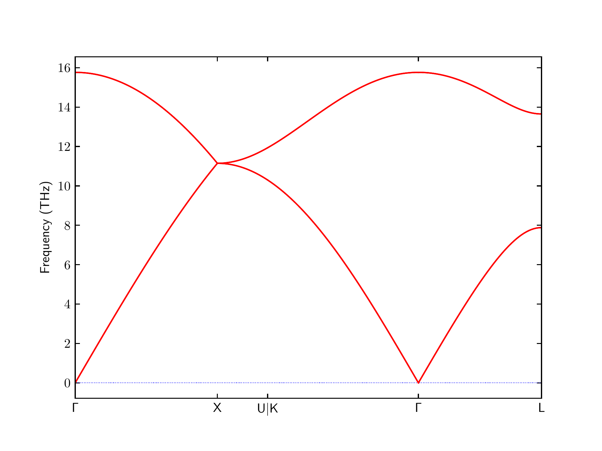

<a name="2_Phonopy"></a>

!!! info
	For vibrational studies, it is crucial to use structures that are accurately  relaxed. Before starting with actual phonon calculations, make sure you are familiar with [geometry optimization](1_geometry_optimization.md).

??? info "Prerequisite"
	Create a new working directory and copy over the `geometry.in.next_step` file you obtained from the previous geometry optimization as your new `geometry.in` file.


## Perform a phonon calculation

Setting up a `phonopy` calculation is similar to settings up a `relaxation` (or any other workflow supported by `FHI-vibes`). To ensure that our physical settings don't change, we will copy the `relaxation.in` obtained in the [previous part of the tutorial](1_geometry_optimization.md) to the new working directory and rename it to `phonopy.in`. Please delete the `relaxation` specific sections `[relaxation]` and `[relaxation.kwargs]` and add settings for a phonopy calculation by running

```
vibes template phonopy >> phonopy.in
```

??? info "`phonopy.in`"
	```
	[calculator]
    name:                          aims
    
    [calculator.parameters]
    xc:                            pw-lda
    
    [calculator.kpoints]
    density:                       2
    
    [calculator.basissets]
    default:                       light
    
    [calculator.socketio]
    port:                          12345
    
    [phonopy]
    supercell_matrix:              [1, 1, 1]
    displacement:                  0.01
    is_diagonal:                   False
    is_plusminus:                  auto
    symprec:                       1e-05
    q_mesh:                        [45, 45, 45]
    workdir:                       phonopy
    ```

Obviously the most important section in the `phonopy.in` input file is `[phonopy]` which containts information about how the supercells with displacements should be set up to compute the force constants from the [finite-differences method](0_intro.md#Phonons). An explanation for the full list of keywords is found in the [documentation](../Documentation/phonopy.md). The most important two are explaned in the following:

### Supercell Matrix (`supercell_matrix`)

The supercell matrix $M_{\rm S}$ given as `supercell_matrix` will be used to [generate the lattice of the supercell from the lattice of the primitive unitcell by matrix multiplication:](https://phonopy.github.io/phonopy/phonopy-module.html#supercell-matrix)

$$
\begin{align}
	\require{mediawiki-texvc}
	\def\t#1{\text{#1}}
	\begin{pmatrix}
		\mathbf a_\t{S}^\t{t} \\ \mathbf b_\t{S}^\t{t} \\ \mathbf c_\t{S}^\t{t}
	\end{pmatrix}
	=
	M_\t{S} \cdot
	\begin{pmatrix}
	\mathbf a_\t{u}^\t{t} \\ \mathbf b_\t{u}^\t{t} \\ \mathbf c_\t{u}^\t{t}
	\end{pmatrix}
	 ~.
	 \label{eq:smatrix}
\end{align}
$$

Here, $\mathbf a_\t{u}^\t{t}$, $\mathbf b_\t{u}^\t{t}$, $\mathbf c_\t{u}^\t{t}$ are the transposed lattice vectors (row-vectors) of the (primitive) unit cell and $\mathbf a_\t{S}$, $\mathbf b_\t{S}$, $\mathbf c_\t{S}$ label the lattice vectors of the supercell respectively. `supercell_matrix` can be given in any shape that lets itself transform trivially to a $3 \times 3$-matrix. For example, `[1, 1, 1]` gets transformed to the $3 \times 3$ unit matrix.

### Displacement (`displacement`)

The `displacement` tag will set the amplitude of the finite displacement in $\AA$. The same parameter is called [`DISPLACEMENT_DISTANCE` in `phonopy`](https://phonopy.github.io/phonopy/setting-tags.html#displacement-distance). In principle, this is a numerical parameter that needs to be optimized. A smaller `discplacement` results in a better approximation to the true second derivative of the potential. However, a too small displacement generates too small forces that can be severely affected by other sources of computational noise, e.g., finite grids etc. For production purposes, the default value of $d = 0.01\,\AA$ usually works quite well and with a properly set up force calculator, there is no need to increase the displacement further.

### Run the calculation

Let's stick to the default settings in `phonopy.in` for the moment and run the calculation with

```
vibes run phonopy | tee log.phonopy 
```

The calculation should take only a few seconds (depending on you computer).

### Basic postprocessing

After the calculation is finished, perform a basic postprocess with

```
vibes output phonopy phonopy/trajectory.son -v -bs
```

??? note "Terminal output"
	```
    [phonopy.postprocess] Start phonopy postprocess:
    [trajectory]   Parse `phonopy/trajectory.son`
    [son] read file:  phonopy/trajectory.son
    [son] process:    |||||||||||||||||||||||||||||||||||||  2/2
    [trajectory]   .. create atoms
    [progress]        |||||||||||||||||||||||||||||||||||||  1/1
    [trajectory]   .. done in 0.001s
    [phonopy.postprocess] .. done in 0.034s
    [phonopy.postprocess] 
    Extract phonopy results:
    [phonopy.postprocess] .. q_mesh:   [45, 45, 45]
    [phonopy.postprocess] .. write force constants
    [phonopy.postprocess] Extract basic results:
    [phonopy.postprocess] .. write primitive cell
    [phonopy.postprocess] .. write supercell
    [phonopy.postprocess] .. write force constants to FORCE_CONSTANTS
    [phonopy.postprocess] Extract bandstructure
    [phonopy.postprocess] .. write yaml
    [phonopy.postprocess] .. plot
    [phonopy.postprocess] .. all files written to phonopy/output in 1.113s
    * Message from file vibes/phonopy/postprocess.py, line 123, function check_negative_frequencies:
        --> Negative frequencies found at G = [0 0 0]:

    # Mode   Frequency
        1 -1.62419e-07 THz
        2 -1.15231e-07 THz
    [phonopy.postprocess] 
    Frequencies at Gamma point:
    q = [0. 0. 0.] (weight= 1)
    # Mode   Frequency
        1   -0.0000002 THz
        2   -0.0000001 THz
        3    0.0000002 THz
        4   15.7649077 THz
        5   15.7649078 THz
        6   15.7649079 THz
    ```
This will:

- Reconstruct the `phonopy` calculation, i.e., the supercell and supercells with displacements as specified in `phonopy.in`,
- use the calculated forces saved in the trajectory file `trajectory.son` to create the force constants for the supercell,
- save the primitive cell and the supercell as `geometry.in.primitive` and `geometry.in.supercell` to the folder `phonopy/output`,
- save the force constants in the file `FORCE_CONSTANTS` that [is defined by `phonopy`](https://phonopy.github.io/phonopy/input-files.html#force-constants-and-force-constants-hdf5), and
- save a plot of the phonon bandstructure in `phonopy/output/bandstructure.pdf`.

??? info "Bandstructure"
	
	
**Congratulations!** You have just performed a full _ab initio_ phonon bandstructure calculation.

## More post processing

### DOS and Thermal Properties
After you managed to compute the band structure, we proceed with evaluating and plotting the density of states and thermal properties. You can do this as with the CLI command `vibes output phonopy –full`:
```
vibes output phonopy phonopy/trajectory.son --full
```
This will compute the frequencies on a grid of $45 \times 45 \times 45$ $\bf q$ points per default and uses the so-called Tetrahedron method to interpolate between the points. Afterwards it  counts the number of frequencies in bins of finite size. Depending on the calculation, the q-grid can be adjusted by specifying it with an additional flag 
`--q_mesh`.
The density of states will be plotted alongside the bandstructure to a file `output/bandstructure_dos.pdf`, and written to a data file [`total_dos.dat`](https://phonopy.github.io/phonopy/output-files.html#total-dos-dat-and-projected-dos-dat).

The DOS is then used to evaluate the harmonic free energy $F^{\rm ha}$ and the harmonic heat capacity at constant volume, $C_V$, i.e., the thermal properties accessible in the harmonic approximation.  An overview plot is saved to `output/thermal_properties.pdf` and the detailed output is written to [`output/thermal_properties.yaml`](https://phonopy.github.io/phonopy/output-files.html#thermal-properties-yaml).

## Choosing a supercell size

!!! info
	The ideal supercell size and shape depends on your problem at hand and it is difficult to give definite advice. In practice, the supercell size needs to be converged until the target property of interest is not changing anymore.  However there is a CLI tool that can help you to create supercells of different sizes.

There is a [CLI utility](Documentation/cli/#vibes-utils)  in`FHI-vibes` that can help you to find supercells of different sizes:

```
vibes utils make-supercell
```

For example

```
vibes utils make-supercell geometry.in -n 8
```

will find the conventional, cubic cell of silicon with 8 atoms:

```
...
Settings:
  Target number of atoms: 8

Supercell matrix:
 python:  [-1,  1,  1,  1, -1,  1,  1,  1, -1]
 cmdline: -1 1 1 1 -1 1 1 1 -1
 2d:
[[-1, 1, 1],
 [1, -1, 1],
 [1, 1, -1]]

Superlattice:
[[5.42906529 0.         0.        ]
 [0.         5.42906529 0.        ]
 [0.         0.         5.42906529]]

Number of atoms:  8
  Cubicness:         1.000 (1.000)
  Largest Cutoff:    2.715 AA
  Number of displacements: 1 (1)

Supercell written to geometry.in.supercell_8
```

It will tell you the supercell matrix that you can use in `phonopy.in` (`python:  [-1,  1,  1,  1, -1,  1,  1,  1, -1]`), the generated superlattice, a "cubicness" score based on the filling ratio of the largest sphere fitting into the cell, the largest cutoff in which any neighbor is not a periodic image of a closer neighbor to estimate boundary effects, and the number of supercells with displacements that  `phonopy` will create. It will also write the structure to `geometry.in.supercell_8` which you can inspect, e.g., with `jmol`.

### Practical guideline

In practice, you should go at least for about 200 atoms in semiconductors and try to find a cubic-as-possible supercell shape. Playing around with `utils make-supercell` and a little bit of experience will do the job.