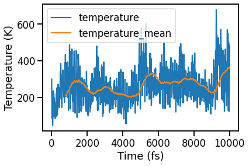
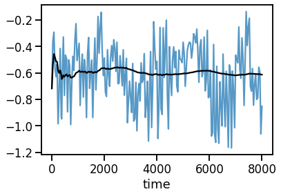
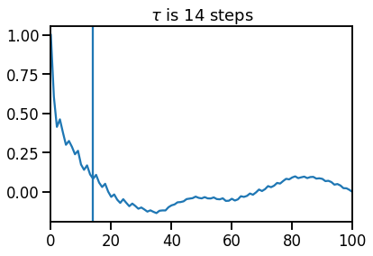

# Postprocessing

!!! warning
	We assume you successfully ran the simulation of LDA-Silicon at $300\,{\rm K}$ from the [previous chapter](3_md_ab_initio.md) and created a `trajectory.nc` dataset. You can can also take the reference data from [here](https://gitlab.com/vibes-developers/vibes-tutorial-files/-/tree/master/3_molecular_dynamics/ab_initio/si_8).

CC: We are missing an aims: section to explain what one should learn.

### Example: Pressure

We will now evaluate the potential pressure observed during the simulation, as [introduced earlier](3_md_intro.md#example-pressure). We will use [xarray](http://xarray.pydata.org/) and [pandas](https://pandas.pydata.org/) for the analysis. For interactive data exploration, we recommend to run the code in a [jupyter notebook](https://jupyter.org/) and play around with the suggested parameters like windows sizes etc.

CC: If one does not use Jupyther, the scripts below do not give any output (missing plot.show/save). One should mention that.
Also, they have to be run subsequently and not as individual scripts. Can we provid the whole script as download and say here
that we just discuss individaul sections?

#### Load trajectory dataset

We first load the trajectory dataset and visualize the temperature:

CC: In the below script, I made the variable names more explicit and extented the
comments so that even panda/xarray novices have a chance of grasping what is going
on. Please use similarly explicit comments and variable names throughout the tutorial
and explaing each parameter.

```python
import xarray as xr


# load the trajectory dataset "trajectory.nc" from disk into the xarray all_data
all_data = xr.load_dataset("trajectory.nc")

# extract temperature and potential pressure from all the data and convert to pandas.DataFrame
T_and_p = all_data[["temperature", "pressure_potential"]].to_dataframe()

# attach a moving average (width=200 timesteps) of the temperature
T_and_p["temperature_mean"] = T_and_p.temperature.rolling(window=200).mean()

# plot temperature and temperature_mean as function of time
T_and_p[["temperature", "temperature_mean"]].plot()
```

??? info "`T_and_p.plot`"
	

CC: Plot has no units.
	
Since the calculation starts with all atoms located at their equilibrium positions, the initial potential energy is zero and the kinetic energy corresponds to ~300K, since we have setup the velocities
using the Maxwell-Boltzmann distribution. In the first 500 steps of the trajectort, the kinetic energy is partially converted to potential energy at. In turn, the temperature drops from $300\,{\rm K}$ to about $150\,{\rm K}$. 
The missing thermal energy to obtaing a temperature of 300K is then gradually provided by the thermostat, bringing the nuclear temperature back to $\sim 300\,{\rm K}$ after a few $\rm ps$.

#### Discard thermalization period
We can remove the thermalization period from the simulation data, e.g., by [shifting the dataframe](https://pandas.pydata.org/pandas-docs/stable/reference/api/pandas.DataFrame.shift.html):

```python
# discard 500 steps (2ps) of thermalization
shift = 500

df = df.shift(-shift).dropna()

df[['temperature', 'temperature_mean']].plot()
```

??? info "`df.plot` after removing 2500 simulation steps ($5\,{\rm ps}$)"
	

#### Inspect the pressure
We are now ready to inspect the pressure observed in the simulation and plot it including its cumulative average:

```python
from ase.units import GPa

p = df.pressure_potential / GPa

ax = p.plot(alpha=0.75)

p.expanding().mean().plot(ax=ax, color="k")
```

??? info "Plot pressure"
	
	

#### Expectation value and convergence estimation

CC: To be honest, I feel that this whole section, although very nice, has almost nothing to do with FHI-vibes itself. I suggest
to at least mark this explicitly in such a way and explaing what is VIBES related and what is just general thermodynamics/python.

[As discussed earlier](3_md_intro.md), the expectation value of the pressure is given by the mean of the observed pressures,

$$
\begin{align}
\left\langle p_{\rm Pot} \right\rangle
	= \lim_{N_{\rm t} \rightarrow \infty} \frac{1}{N_{\rm t}}
	\sum_n^{N_{\rm t}} 	
	p_{\rm Pot}({\bf R} (t_n))~.
\label{eq:<pPot>}
\end{align}
$$

In our finite simulation, $N_{\rm t} = 2000 < \infty$, so that

$$
\begin{align}
\left\langle p_{\rm Pot} \right\rangle
= \left\langle p_{\rm Pot} \right\rangle_{N_t = 2000} + \Delta~,
\label{eq:p_final}
\end{align}
$$

where $\left\langle p_{\rm Pot} \right\rangle_{N_t = 2000} = -0.076\,{\rm GPa}$ is the mean pressure observed during the finite simulation, and $\Delta$ is the (unknown) difference to the fully converged expectation value. 
Although, full converge would require an infinite trajetcory length and is thus formally never reachable, one can get arbitrarily close in practice and estimate the magnitude of the error $\Delta$.

We estimate this error by computing $\sigma_{\langle p \rangle}$, the [_standard error of the mean_](https://en.wikipedia.org/wiki/Standard_error):

$$
\begin{align}
\Delta \approx \sigma_{\langle p \rangle} = \frac{\sigma_p}{\sqrt{\tilde N_t}}~,
\label{eq:sigma_O}
\end{align}
$$

where $\sigma_p$ is the standard deviation of the pressure distribution observed during the simulation, and $\tilde N_t$ is an estimate of the number of _uncorrelated_ samples provided by the simulation. To this end, we estimate

$$
\begin{align}
\tilde N_t = N_t / \tau~,
\label{eq:N}
\end{align}
$$

where $\tau$ is the correlation time for the pressure.
The most straightforward way to compute $\tau$ is to evaluate the [autocorrelation function](https://en.wikipedia.org/wiki/Autocorrelation) and estimate its decay time:

```python
# estimate correlation time
import pandas as pd
from scipy import signal as si

# substract the mean pressure
pp = p - p.mean()

# get the autocorrelation function from
# https://docs.scipy.org/doc/scipy/reference/generated/scipy.signal.correlate.html
corr = si.correlate(pp, pp)[len(pp) - 1 :]

# normalize to C(0) = 1
corr /= corr[0]

# create as pandas.Series for plotting
s = pd.Series(corr).rolling(min_periods=0, window=10).mean()
ax = s.plot()

# estimate correlation time from the drop below 0.1
tau = s.index.where(s < 0.1).min()
ax.axvline(tau)

ax.set_xlim(0, 100)
ax.set_title(f"$\\tau$ is {int(tau)} steps")
```

??? info "Plot pressure autocorrelation function"
	

In the  present example, the observable decorrelates after about 10 time steps ($\equiv 40\,{\rm fs}$). We therefore estimate the number of uncorrelated samples to be 

$$
\begin{align*}
	\tilde N_t = N_t / 10 \approx 200
\end{align*}
$$

The standard deviation of the pressure distribution is

$$
\begin{align}
	\sigma_p = 0.239\,{\rm GPa}~,
\end{align}
$$

so that according to Eq. $\eqref{eq:sigma_O}$,

$$
\sigma_{\langle p \rangle} = \frac{0.239}{\sqrt{200}}\,{\rm GPa} \approx 0.053\,{\rm GPa}~.
$$


The final result for the pressure according to Eq. $\eqref{eq:p_final}$ is

$$
\begin{align*}
	\langle p_{\rm Pot} (300\,{\rm K}) \rangle = (-0.076 \pm 0.053)\,{\rm GPa}~,
\end{align*}
$$

which means that our result is converged within an estimated precision of $70\,\%$. **Remark:** This does _not_ mean that the true expectation lies within the given range. The estimated error is to be understood in the sense of a [confidence interval](https://en.wikipedia.org/wiki/Confidence_interval#Practical_example). The size of the error signals that the calculation is not fully converged and more sampling time would be necessary to report the observed pressure with confidence. You find reference for a total simulation time of $40\,{\rm ps}$ [here](https://gitlab.com/vibes-developers/vibes-tutorial-files/-/tree/master/3_molecular_dynamics/ab_initio/si_8_longer). How did the value and the error change?

Physics question: The observed potential pressure is negative. _Why?_ Do you expect a positive or negative lattice expansion at $300\,{\rm K}$?

??? info "Code snippet to compute the mean and the error estimator"

    ```python
    mean = p.mean()
    std = p.std()
    err = std / (len(p) / tau) ** 0.5
    
    print(f"Mean:  {mean:.5f} GPa")
    print(f"Std.:  {std:.5f} GPa")
    print(f"Error: {err:.5f} GPa ({abs(err / mean) * 100:.2f} %)")
    ```

### More examples

For more examples on how to directly work with the trajectory dataset in `trajectory.nc`, please have a look at  the [ASE Workshop Tutorial](https://gitlab.com/flokno/ase_workshop_tutorial_19) which analyzes _ab initio_ MD data for a perovskite.
