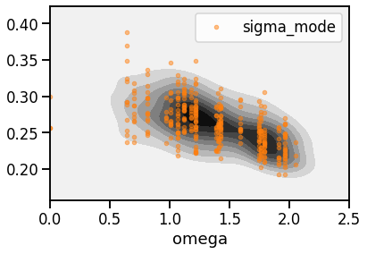

# Anharmonicity Quantification

!!! info
	Please refer to [our paper](references#Knoop2020) for reference.

## Background

In order to estimate the strength of anharmonic effects in a material, we define the _anharmonicity measure_

$$
\begin{align}
\sigma^{\mathrm{A}}(T) \equiv \frac{\sigma\left[F^{\mathrm{A}}\right]_{T}}{\sigma[F]_{T}}=\sqrt{\frac{\sum_{I, \alpha}\left\langle\left(F_{I, \alpha}^{\mathrm{A}}\right)^{2}\right\rangle_{T}}{\sum_{I, \alpha}\left\langle\left(F_{I, \alpha}\right)^{2}\right\rangle_{T}}}~,
\label{eq:sigmaA}
\end{align}
$$

where $\langle \cdot \rangle_T$ denotes an [expectation value at a given temperature](3_md_postprocess.md#expectation-value-and-convergence-estimation), 

$$
\begin{align}
	\left\langle O \right\rangle
	= \lim _{N_{\mathrm{t}} \rightarrow \infty} 
	\frac{1}{N_{\mathrm{t}}} \sum_{n}^{N_{\mathrm{t}}} O\left(t_{n}\right)~,
	\label{eq:meanO}
\end{align}
$$

$F_{I, \alpha} (t)$ is the force component $\alpha$ on atom $I$ at time $t$, and $F^{\rm A}_{I, \alpha}$ is the anharmonic contribution

$$
\begin{align}
	F_{I, \alpha}^{\mathrm{A}}(t)
	=F_{I, \alpha}(t)-F_{I, \alpha}^{(2)}(t)~,
	\label{eq:FA}
\end{align}
$$

where 

$$
\begin{align}
	F_{I, \alpha}^{(2)} (t)
	=
	-\sum_{J, \beta} \Phi_{\alpha, \beta}^{I, J} \Delta R_{J}^{\beta} (t)
\label{eq:F2}
\end{align}
$$

is the harmonic contribution to the force.


## Evaluating $\sigma^{\rm A}$ with `FHI-vibes`

The necessary ingredient to evaluate Eq. $\eqref{eq:sigmaA}$ are:
- Atomic forces $F_{I, \alpha}$,
- harmonic force constants $\Phi^{IJ}$ to compute $F_{I, \alpha}^{(2)}$ according to Eq. $\eqref{eq:F2}$ for evaluating Eq. $\eqref{eq:FA}$ , and
- thermodynamic expectation values according to Eq. $\eqref{eq:meanO}$.

These ingredients can be obtained with `FHI-vibes` with the following workflow:

- Take the materials of interest and generate a reference structure, i.e., a primitive cell and a supercell.
- Obtain force constants for the supercell as introduced in the [phonons tutorial](2_phonopy.md).
- Run an MD simulation for the supercell as introduced in the [MD tutorial](3_md_canonical_sampling.md).

### Example: LJ-Argon at $20\,{\rm K}$

Assuming that  you performed the previous tutorials, we already have all the necessary ingredients available.

In a new working directory, copy your `trajectory.nc` dataset from the the [MD tutorial](3_md_canonical_sampling.md) and your force constants from the [harmonic sampling tutorial](4_statistical_sampling.md#obtain-force-constants), i.e., the file `phonopy/output/FORCE_CONSTANTS`. You can attach the force constants to the trajectory dataset with the CLI tool `utils trajectory update`:

```
vibes utils trajectory update trajectory.nc -fc FORCE_CONSTANTS 
```

This will attach read the force constants from `FORCE_CONSTANTS` and attach them to the trajectory dataset.

To evaluate Eq. $\eqref{eq:sigmaA}$, you can use the CLI tool `utils anharmonicity sigma`:

```
vibes utils anharmonicity sigma trajectory.nc
```

which will give you the total $\sigma^{\rm A}$ value (`sigma`), as well as an individual value for each atom species. The output should be 

```
DataFrame:
       sigma  sigma [Ar]  sigma_atom_mean  sigma_mode
Ar  0.251369    0.251369         0.251369    0.251365
```

This tells you that the average magnitude of anharmonic contributions to the forces, $F^{\rm A}$, in Lennard-Jones Argon at $20\,{\rm K}$ is about $25\,\%$. This is already a larger anharmonic contribution as you would find in silicon at $300\,{\rm K}$.


## Mode resolved anharmonicity

```
vibes utils anharmonicity mode trajectory.nc 
```


```python
import pandas as pd
import seaborn as sns


s = pd.read_csv("sigmaA_mode_Ar.csv", index_col=0)

ax = sns.kdeplot(s.index, s, shade=True, cmap="gray_r")
s.plot(marker=".", lw=0, alpha=0.5, ax=ax)

ax.set_xlim(0, 2.5)
```

??? info "Plot of mode resolved sigma"
	